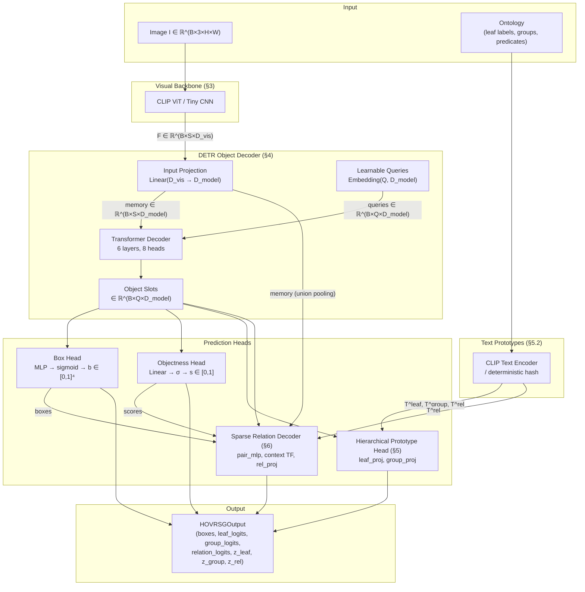
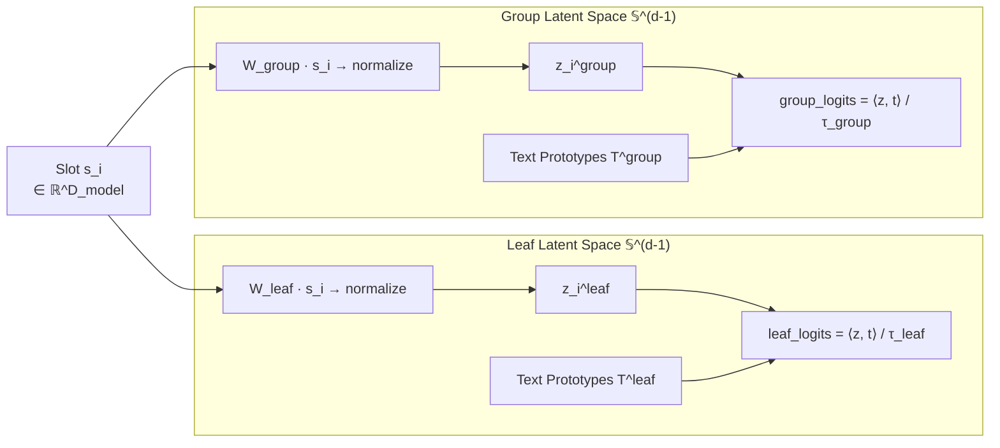
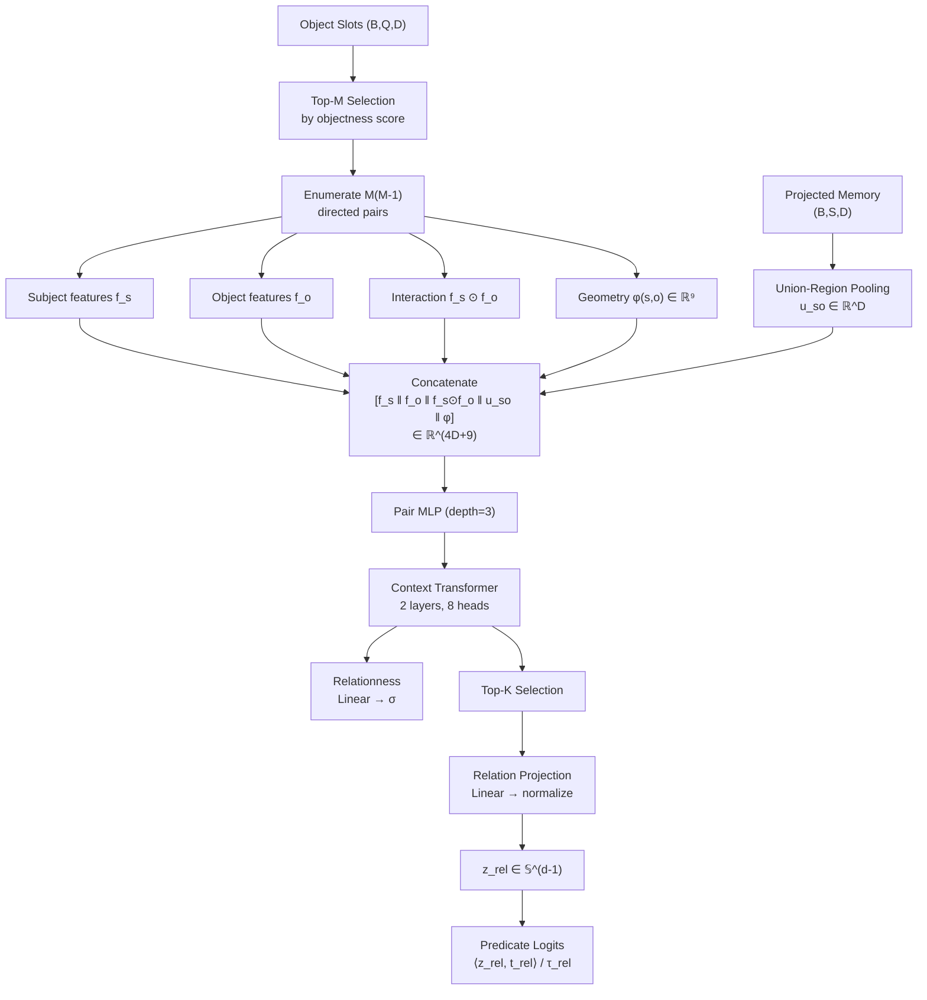
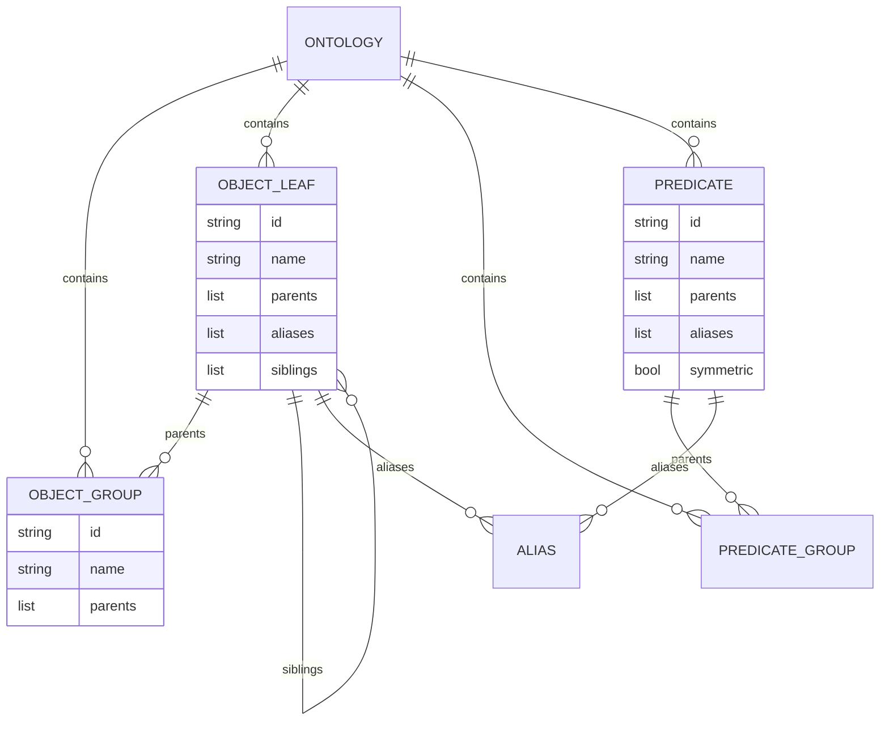
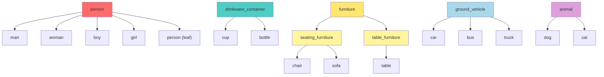

# HOVR-SG: Tài liệu Toán học & Kiến trúc Hệ thống

## Mục lục

1. [Phát biểu bài toán](#1-phát-biểu-bài-toán)
2. [Kiến trúc tổng quan](#2-kiến-trúc-tổng-quan)
3. [Visual Backbone](#3-visual-backbone)
4. [DETR Object Decoder](#4-detr-object-decoder)
5. [Hierarchical Prototype Head](#5-hierarchical-prototype-head---dual-latent-space)
6. [Sparse Relation Decoder](#6-sparse-relation-decoder)
7. [Hệ thống Loss](#7-hệ-thống-loss---8-thành-phần)
8. [Hungarian Matching](#8-hungarian-matching)
9. [Multi-stage Training](#9-multi-stage-training-protocol)
10. [Inference & Scoring](#10-inference--scoring)
11. [Evaluation Metrics](#11-evaluation-metrics)
12. [Ontology System](#12-ontology-system)

---

## 1. Phát biểu bài toán

### 1.1. Định nghĩa Scene Graph

Cho ảnh đầu vào $I \in \mathbb{R}^{3 \times H \times W}$, mô hình cần sinh ra một **scene graph** có hướng:

$$G = (V, E)$$

trong đó tập đỉnh (nodes) biểu diễn các đối tượng:

$$V = \{v_i = (b_i, c_i^{\text{leaf}}, c_i^{\text{group}}, z_i^{\text{leaf}}, z_i^{\text{group}}, s_i)\}_{i=1}^{N}$$

| Ký hiệu | Ý nghĩa | Miền |
|---|---|---|
| $b_i \in [0,1]^4$ | Bounding box chuẩn hóa $(x_1, y_1, x_2, y_2)$ | $[0,1]^4$ |
| $c_i^{\text{leaf}} \in \mathcal{C}_{\text{leaf}}$ | Nhãn lá (leaf label) — ví dụ `man`, `cup` | Discrete |
| $c_i^{\text{group}} \subseteq \mathcal{C}_{\text{group}}$ | Nhãn nhóm (group labels) — ví dụ `person`, `drinkware` | Multi-label |
| $z_i^{\text{leaf}} \in \mathbb{S}^{d-1}$ | Embedding lá trên mặt cầu đơn vị | Unit sphere |
| $z_i^{\text{group}} \in \mathbb{S}^{d-1}$ | Embedding nhóm trên mặt cầu đơn vị | Unit sphere |
| $s_i \in [0,1]$ | Objectness score | Probability |

Tập cạnh (edges) biểu diễn quan hệ có hướng:

$$E = \{e_{ij} = (i, r_{ij}, j, p_{ij})\}$$

trong đó $r_{ij} \in \mathcal{R}$ là predicate (ví dụ `holding`, `on`) và $p_{ij} \in [0,1]$ là confidence.

### 1.2. Bốn setting đánh giá

Gọi $\mathcal{C}_{\text{base}}, \mathcal{C}_{\text{novel}}$ là phân hoạch vocabulary đối tượng, $\mathcal{R}_{\text{base}}, \mathcal{R}_{\text{novel}}$ là phân hoạch vocabulary quan hệ:

| Setting | Objects | Relations | Ký hiệu |
|---|---|---|---|
| Seen-Seen | $\mathcal{C}_{\text{base}}$ | $\mathcal{R}_{\text{base}}$ | SS |
| Novel-Seen | $\mathcal{C}_{\text{novel}} \cup \mathcal{C}_{\text{base}}$ | $\mathcal{R}_{\text{base}}$ | NS |
| Seen-Novel | $\mathcal{C}_{\text{base}}$ | $\mathcal{R}_{\text{novel}} \cup \mathcal{R}_{\text{base}}$ | SN |
| Novel-Novel | $\mathcal{C}_{\text{novel}} \cup \mathcal{C}_{\text{base}}$ | $\mathcal{R}_{\text{novel}} \cup \mathcal{R}_{\text{base}}$ | NN |

---

## 2. Kiến trúc tổng quan

### Ký hiệu chung

| Ký hiệu | Giá trị mặc định | Ý nghĩa |
|---|---|---|
| $B$ | — | Batch size |
| $S$ | $(H/p)^2$ | Số spatial tokens (patches) |
| $Q$ | 64 | Số object queries |
| $D_{\text{vis}}$ | 768 (CLIP) / 256 (Tiny) | Chiều visual features |
| $D_{\text{model}}$ | 256 | Chiều Transformer nội bộ |
| $D_{\text{latent}}$ | 512 (CLIP) / 256 (Tiny) | Chiều latent/prototype space |
| $M$ | 16 | Top-M objects cho relation |
| $K$ | 64 | Top-K relation pairs |
| $\lvert\mathcal{C}_{\text{leaf}}\rvert$ | 15 | Số leaf classes |
| $\lvert\mathcal{C}_{\text{group}}\rvert$ | 7 | Số group classes |
| $\lvert\mathcal{R}\rvert$ | 11 | Số predicates |

---

## 3. Visual Backbone

### 3.1. CLIP Vision Tower (nghiên cứu)

Sử dụng `CLIPVisionModel` từ Hugging Face, loại bỏ CLS token, chỉ giữ **spatial patch tokens**:

$$\text{Encoder}_{\text{CLIP}}: I \in \mathbb{R}^{B \times 3 \times H_{\text{img}} \times W_{\text{img}}} \;\longrightarrow\; F \in \mathbb{R}^{B \times S \times D_{\text{vis}}}$$

trong đó:
$$S = \left(\frac{H_{\text{img}}}{p}\right) \times \left(\frac{W_{\text{img}}}{p}\right), \qquad p = \text{patch\_size}$$

Với CLIP ViT-B/32: $H_{\text{img}} = W_{\text{img}} = 224$, $p = 32$ → $S = 7 \times 7 = 49$, $D_{\text{vis}} = 768$.

**Freeze policy:** Mặc định toàn bộ CLIP tower frozen. Có thể unfreeze $n$ layers cuối cùng cho fine-tuning:

$$\theta_{\text{trainable}} = \begin{cases} \emptyset & \text{if frozen} \\ \{\theta_{\text{layer}[-n:]}, \theta_{\text{post\_LN}}\} & \text{if unfreeze\_last\_n} \end{cases}$$

**Normalization:** 
$$\mu_{\text{CLIP}} = (0.48145, 0.45783, 0.40821), \quad \sigma_{\text{CLIP}} = (0.26863, 0.26130, 0.27578)$$

### 3.2. Tiny CNN (smoke test)

Kiến trúc 3 lớp Conv2d với stride tổng = 8:

$$\text{Conv}_{7 \times 7}^{s=2}(3 \to 64) \;\to\; \text{GN}_8 \;\to\; \text{GELU} \;\to\; \text{Conv}_{3 \times 3}^{s=2}(64 \to 128) \;\to\; \text{GN}_8 \;\to\; \text{GELU} \;\to\; \text{Conv}_{3 \times 3}^{s=2}(128 \to D_{\text{vis}}) \;\to\; \text{GN}_{16} \;\to\; \text{GELU}$$

Output: $\text{flatten}(2) \circ \text{transpose}(1,2) \Rightarrow F \in \mathbb{R}^{B \times S \times D_{\text{vis}}}$ với $S = (H/8)^2$.

---

## 4. DETR Object Decoder

### 4.1. Input Projection

$$\text{memory} = W_{\text{proj}} \cdot F + b_{\text{proj}}, \qquad W_{\text{proj}} \in \mathbb{R}^{D_{\text{model}} \times D_{\text{vis}}}$$

### 4.2. Learnable Object Queries

$$Q = \{q_i\}_{i=1}^{N_q}, \qquad q_i \in \mathbb{R}^{D_{\text{model}}}, \qquad Q \sim \text{nn.Embedding}(N_q, D_{\text{model}})$$

Queries được broadcast sang batch: $Q_{\text{batch}} = Q[:\!] \otimes \mathbf{1}_B \in \mathbb{R}^{B \times N_q \times D_{\text{model}}}$

### 4.3. Transformer Decoder

Stack gồm **6 layers**, mỗi layer là `TransformerDecoderLayer` với **Pre-LN** (`norm_first=True`):

$$\text{slots} = \text{TransformerDecoder}(Q_{\text{batch}},\; \text{memory})$$

Mỗi layer thực hiện:

$$\begin{align}
\hat{x} &= \text{LayerNorm}(x) \\
x' &= x + \text{MultiHeadSelfAttn}(\hat{x}, \hat{x}, \hat{x}) & \text{(self-attention giữa queries)} \\
\hat{x'} &= \text{LayerNorm}(x') \\
x'' &= x' + \text{MultiHeadCrossAttn}(\hat{x'}, \text{memory}, \text{memory}) & \text{(cross-attention query↔memory)} \\
\hat{x''} &= \text{LayerNorm}(x'') \\
\text{out} &= x'' + \text{FFN}(\hat{x''}) & \text{(feed-forward)}
\end{align}$$

> [!IMPORTANT]
> **Multi-Head Attention:** 8 heads, $d_k = D_{\text{model}} / 8$
> 
> **FFN:** $\text{Linear}(D_{\text{model}} \to 4D_{\text{model}}) \to \text{ReLU} \to \text{Linear}(4D_{\text{model}} \to D_{\text{model}})$

Output: $\text{slots} \in \mathbb{R}^{B \times Q \times D_{\text{model}}}$ — mỗi slot biểu diễn một object candidate.

### 4.4. Box Head

MLP depth=3 với sigmoid output:

$$\hat{b}_i = \sigma\!\Big(\text{MLP}^{(3)}(s_i)\Big) \in [0,1]^4, \qquad \text{MLP}^{(3)}: \mathbb{R}^{D_{\text{model}}} \xrightarrow{\text{Linear}} \mathbb{R}^{D_{\text{model}}} \xrightarrow{\text{GELU}} \xrightarrow{\text{Linear}} \mathbb{R}^{D_{\text{model}}} \xrightarrow{\text{GELU}} \xrightarrow{\text{Linear}} \mathbb{R}^4$$

### 4.5. Objectness Head

$$\hat{o}_i = \sigma\!\big(w_{\text{obj}}^\top s_i + b_{\text{obj}}\big) \in [0,1]$$

---

## 5. Hierarchical Prototype Head — Dual Latent Space

### 5.1. Thiết kế hai không gian latent

Mỗi object slot $s_i$ được project vào **hai không gian riêng biệt**:

$$\boxed{z_i^{\text{leaf}} = \frac{W_{\text{leaf}} \cdot s_i}{\|W_{\text{leaf}} \cdot s_i\|_2} \in \mathbb{S}^{D_{\text{latent}}-1}}$$

$$\boxed{z_i^{\text{group}} = \frac{W_{\text{group}} \cdot s_i}{\|W_{\text{group}} \cdot s_i\|_2} \in \mathbb{S}^{D_{\text{latent}}-1}}$$

trong đó $W_{\text{leaf}}, W_{\text{group}} \in \mathbb{R}^{D_{\text{latent}} \times D_{\text{model}}}$ là **hai projection matrices khác nhau**.

> [!TIP]
> **Tại sao hai projection riêng biệt?**
> - Trong **leaf space**: `man`, `woman`, `girl` phải **tách biệt** (khác nhau)
> - Trong **group space**: cả ba phải **gần nhau** (đều là `person`)
> - Nếu dùng chung một projection, hai mục tiêu này mâu thuẫn → semantic collapse

### 5.2. Text Prototypes

Mỗi vocabulary được encode thành tập prototypes trên mặt cầu đơn vị:

$$T^{\text{leaf}} = \{t_c^{\text{leaf}}\}_{c \in \mathcal{C}_{\text{leaf}}} \in \mathbb{R}^{|\mathcal{C}_{\text{leaf}}| \times D_{\text{latent}}}, \qquad \|t_c^{\text{leaf}}\|_2 = 1$$

$$T^{\text{group}} = \{t_g^{\text{group}}\}_{g \in \mathcal{C}_{\text{group}}} \in \mathbb{R}^{|\mathcal{C}_{\text{group}}| \times D_{\text{latent}}}, \qquad \|t_g^{\text{group}}\|_2 = 1$$

$$T^{\text{rel}} = \{t_r^{\text{rel}}\}_{r \in \mathcal{R}} \in \mathbb{R}^{|\mathcal{R}| \times D_{\text{latent}}}, \qquad \|t_r^{\text{rel}}\|_2 = 1$$

**Encode method (CLIP):**
$$t_c = \frac{\text{CLIP}_{\text{text}}(\text{template}(c))}{\|\text{CLIP}_{\text{text}}(\text{template}(c))\|_2}, \qquad \text{template}(c) = \text{``a photo of a \{c\}''}$$

### 5.3. Classification bằng Cosine Similarity

Leaf classification logits (softmax classification):

$$\boxed{\ell_{ic}^{\text{leaf}} = \frac{z_i^{\text{leaf}} \cdot t_c^{\text{leaf}}}{\tau_{\text{leaf}}}}, \qquad \tau_{\text{leaf}} = \exp(\log \tau_{\text{leaf}}) \geq 10^{-4}$$

Group classification logits (multi-label sigmoid):

$$\boxed{\ell_{ig}^{\text{group}} = \frac{z_i^{\text{group}} \cdot t_g^{\text{group}}}{\tau_{\text{group}}}}, \qquad \tau_{\text{group}} = \exp(\log \tau_{\text{group}}) \in [0.01, 0.10]$$

**Temperature parameters** $\log \tau_{\text{leaf}}, \log \tau_{\text{group}}$ được khởi tạo tại $\log(0.07) \approx -2.659$ và **learnable**. Việc giới hạn $\tau \in [0.01, 0.10]$ ngăn ngừa tình trạng gradient bùng nổ khi $\tau \to 0$.

### 5.4. Diagram Latent Space

---

## 6. Sparse Relation Decoder

### 6.1. Object Selection (Top-M)

Chọn $M$ objects có objectness score cao nhất:

$$\mathcal{S} = \text{TopK}_{M}\!\big(\{\hat{o}_i\}_{i=1}^{Q}\big), \qquad |\mathcal{S}| = M$$

### 6.2. Pair Enumeration

Liệt kê mọi cặp có hướng $(i, j)$ với $i \neq j$:

$$\mathcal{P} = \{(i, j) \mid i, j \in \mathcal{S},\; i \neq j\}, \qquad |\mathcal{P}| = M(M-1)$$

### 6.3. Geometric Features — 9 chiều

Cho cặp $(s, o)$ với boxes $b_s = (x_1^s, y_1^s, x_2^s, y_2^s)$ và $b_o = (x_1^o, y_1^o, x_2^o, y_2^o)$:

Trung tâm và kích thước:
$$c_s = \frac{(x_1^s, y_1^s) + (x_2^s, y_2^s)}{2}, \quad w_s = x_2^s - x_1^s, \quad h_s = y_2^s - y_1^s$$

IoU:
$$\text{IoU}(b_s, b_o) = \frac{|b_s \cap b_o|}{|b_s \cup b_o|}$$

Vector geometry $\phi \in \mathbb{R}^9$:

$$\boxed{\phi(s, o) = \begin{pmatrix} \frac{c_o^x - c_s^x}{w_s} \\ \frac{c_o^y - c_s^y}{h_s} \\ \log\!\left(\frac{w_o}{w_s}\right) \\ \log\!\left(\frac{h_o}{h_s}\right) \\ \log(w_s \cdot h_s) \\ \log(w_o \cdot h_o) \\ \text{IoU}(b_s, b_o) \\ \frac{c_o^x - c_s^x}{w_o} \\ \frac{c_o^y - c_s^y}{h_o} \end{pmatrix}}$$

| Chiều | Ý nghĩa vật lý |
|---|---|
| 0–1 | Offset trung tâm chuẩn hóa theo subject |
| 2–3 | Log tỷ lệ kích thước object/subject |
| 4–5 | Log diện tích subject và object |
| 6 | IoU giữa hai boxes |
| 7–8 | Offset trung tâm chuẩn hóa theo object |

### 6.4. Union-Region Features — Spatial Pooling

Union box được tạo từ bounding box chuẩn hoá của Subject và Object:

$$b_{\text{union}}^{so} = \Big(\min(x_1^s, x_1^o),\; \min(y_1^s, y_1^o),\; \max(x_2^s, x_2^o),\; \max(y_2^s, y_2^o)\Big)$$

Để tối ưu bộ nhớ GPU khi xử lý ảnh phân giải cao, quá trình trích xuất đặc trưng sử dụng **RoIAlign** (từ thư viện `torchvision.ops`):
1. Chuyển đổi $S$ patch tokens (1D sequence) trở lại feature map 2D có hình dạng $H \times W$.
2. Áp dụng RoIAlign trên $b_{\text{union}}^{so}$ với output size $7 \times 7$.
3. Average pooling qua không gian $7 \times 7$ để thu được một vector $u_{so}$ duy nhất.

$$\boxed{u_{so} = \text{AvgPool}_{7 \times 7}\big( \text{RoIAlign}(\text{memory}, b_{\text{union}}^{so}) \big) \;\in\; \mathbb{R}^{D_{\text{model}}}}$$

### 6.5. Pair Feature Construction

$$\boxed{h_{so} = \text{MLP}^{(3)}\!\Big(\big[f_s \;\|\; f_o \;\|\; f_s \odot f_o \;\|\; u_{so} \;\|\; \phi(s,o)\big]\Big)}$$

Input dimension: $4 \times D_{\text{model}} + 9$

| Component | Dim | Ý nghĩa |
|---|---|---|
| $f_s$ | $D_{\text{model}}$ | Subject slot features |
| $f_o$ | $D_{\text{model}}$ | Object slot features |
| $f_s \odot f_o$ | $D_{\text{model}}$ | Hadamard product (element-wise interaction) |
| $u_{so}$ | $D_{\text{model}}$ | Union-region pooled features |
| $\phi(s,o)$ | 9 | Geometric features |

### 6.6. Context Transformer

$$h'_{so} = \text{TransformerEncoder}^{(2)}(h_{so})$$

2-layer Transformer Encoder với Pre-LN, 8 heads, FFN dim = $4 \times \text{hidden}$.

Cho phép tất cả các cặp quan hệ attend lẫn nhau → context-aware reasoning.

### 6.7. Relationness Score

$$\hat{r}_{so} = \sigma\!\big(w_{\text{rel}}^\top h'_{so}\big) \in [0,1]$$

### 6.8. Top-K Selection & Predicate Scoring

Chọn $K$ cặp có relationness cao nhất:
$$\mathcal{P}_K = \text{TopK}_K(\{\hat{r}_{so}\})$$

Relation embedding & predicate logits:

$$z_{so}^{\text{rel}} = \frac{W_{\text{rel}} \cdot h'_{so}}{\|W_{\text{rel}} \cdot h'_{so}\|_2} \;\in\; \mathbb{S}^{D_{\text{latent}}-1}$$

$$\boxed{\ell_{so,r}^{\text{pred}} = \frac{z_{so}^{\text{rel}} \cdot t_r^{\text{rel}}}{\tau_{\text{rel}}}}, \qquad \tau_{\text{rel}} = \exp(\log \tau_{\text{rel}}) \geq 10^{-4}$$

### 6.9. Diagram toàn bộ Relation Decoder

---

## 7. Hệ thống Loss — 8 thành phần

### Tổng quan

$$\boxed{\mathcal{L}_{\text{total}} = \sum_{k} \lambda_k \cdot \mathcal{L}_k}$$

*Lưu ý:* Nếu sử dụng `uncertainty_weighting: true` trong cấu hình, mô hình sẽ học hệ số cân bằng đa nhiệm theo Kendall et al.:
$$\mathcal{L}_{\text{total}} = \sum_{k} \lambda_k \Big( \frac{1}{2\sigma_k^2}\mathcal{L}_k + \log \sigma_k \Big)$$

| # | $\mathcal{L}_k$ | $\lambda_k$ (mặc định) | Loại | Mục tiêu |
|---|---|---|---|---|
| 1 | Objectness | 1.0 | Sigmoid Focal | Background vs foreground |
| 2 | Leaf | 1.0 | Contrastive CE | Phân loại leaf label |
| 3 | Group | 0.35 | Sigmoid Focal | Multi-label group classification |
| 4 | Ancestor | 0.25 | Hierarchical | $P(\text{leaf}) \leq P(\text{group})$ |
| 5 | Sibling | 0.25 | Margin | Tách siblings trong latent |
| 6 | Box L1 | 5.0 | L1 Regression | Bounding box accuracy |
| 7 | Relationness | 1.0 | Sigmoid Focal | Có/không có relation |
| 8 | Predicate | 1.0 | Contrastive CE | Phân loại predicate |

---

### 7.1. Sigmoid Focal Loss

Dùng cho: objectness, group classification, relationness.

$$\boxed{\mathcal{L}_{\text{focal}}(\hat{y}, y) = \frac{1}{N}\sum_i \alpha_t \cdot \text{BCE}(\hat{y}_i, y_i) \cdot (1 - p_t)^\gamma}$$

trong đó:

$$p_t = \begin{cases} \sigma(\hat{y}_i) & \text{if } y_i = 1 \\ 1 - \sigma(\hat{y}_i) & \text{if } y_i = 0 \end{cases}, \qquad \alpha_t = \begin{cases} \alpha & \text{if } y_i = 1 \\ 1 - \alpha & \text{if } y_i = 0 \end{cases}$$

**Hyperparameters:** $\alpha = 0.25$, $\gamma = 2.0$

**Giải thích:** $(1 - p_t)^\gamma$ down-weight easy examples (confident correct predictions), tập trung vào hard examples. $\alpha_t$ cân bằng class imbalance giữa positive và negative.

---

### 7.2. Prototype Contrastive Loss

Dùng cho: leaf classification, predicate classification.

$$\boxed{\mathcal{L}_{\text{contrast}}(z, T, y) = -\frac{1}{N}\sum_i \log \frac{\exp\!\big(\langle \bar{z}_i, \bar{t}_{y_i}\rangle / \tau\big)}{\sum_{c=1}^{C} \exp\!\big(\langle \bar{z}_i, \bar{t}_c\rangle / \tau\big)}}$$

trong đó $\bar{z} = z / \|z\|_2$, $\bar{t} = t / \|t\|_2$, $\tau \in [0.01, 0.10]$ với giá trị khởi tạo là $0.07$.

Đây chính là **cross-entropy trên cosine similarity** — tương đương InfoNCE loss khi $\tau$ nhỏ.

---

### 7.3. Ancestor Consistency Loss

$$\boxed{\mathcal{L}_{\text{ancestor}} = \frac{1}{|\mathcal{H}|}\sum_{(c, g) \in \mathcal{H}} \text{ReLU}\!\Big(\sigma(\ell_c^{\text{leaf}}) - \sigma(\ell_g^{\text{group}})\Big)}$$

trong đó $\mathcal{H} = \{(c, g) \mid g \in \text{parents}(c)\}$ là tập cặp (leaf, ancestor group) từ ontology.

**Ý nghĩa:** Nếu model dự đoán $P(\text{man}) = 0.9$ thì phải có $P(\text{person}) \geq 0.9$. Loss = 0 khi hierarchy nhất quán.

**Ví dụ cụ thể từ ontology:**

| Leaf $c$ | Group $g$ | Constraint |
|---|---|---|
| `man` | `person` | $\sigma(\ell_{\text{man}}) \leq \sigma(\ell_{\text{person}})$ |
| `cup` | `drinkware_container` | $\sigma(\ell_{\text{cup}}) \leq \sigma(\ell_{\text{drinkware}})$ |
| `chair` | `seating_furniture` | $\sigma(\ell_{\text{chair}}) \leq \sigma(\ell_{\text{seating}})$ |

---

### 7.4. Sibling Margin Loss

$$\boxed{\mathcal{L}_{\text{sibling}} = \frac{1}{|\mathcal{M}|}\sum_{(i, c^+, c^-) \in \mathcal{M}} \text{ReLU}\!\Big(m - \langle \bar{z}_i, \bar{t}_{c^+}\rangle + \langle \bar{z}_i, \bar{t}_{c^-}\rangle\Big)}$$

trong đó:
- $c^+$ là ground-truth leaf label
- $c^- \in \text{siblings}(c^+)$ từ ontology
- $m = 0.20$ là margin
- $\mathcal{M}$ là tập tất cả (sample, positive, sibling) tuples

**Ý nghĩa:** Đảm bảo trong cosine space:

$$\cos(z_i, t_{\text{man}}) > \cos(z_i, t_{\text{woman}}) + 0.20$$

khi ground-truth label là `man` (vì `woman` là sibling của `man`).

**Sibling map từ ontology:**

| Label | Siblings (hard negatives) |
|---|---|
| `man` | `woman`, `boy`, `girl` |
| `cup` | `bottle` |
| `chair` | `table` |
| `car` | `bus`, `truck` |
| `dog` | `cat`, `person` |

---

### 7.5. Box L1 Loss

$$\boxed{\mathcal{L}_{\text{box}} = \frac{1}{4N}\sum_i \|\hat{b}_i - b_i^*\|_1}$$

Tất cả boxes đã chuẩn hóa về $[0,1]$ → L1 loss trên tọa độ chuẩn hóa.

---

### 7.6. Relationness Loss

$$\mathcal{L}_{\text{relness}} = \mathcal{L}_{\text{focal}}\!\Big(\hat{r}_{so},\; \mathbb{1}[\text{exists relation}(s,o)]\Big)$$

Cùng Sigmoid Focal Loss như §7.1.

---

### 7.7. Predicate Contrastive Loss

$$\mathcal{L}_{\text{pred}} = \mathcal{L}_{\text{contrast}}\!\Big(z_{so}^{\text{rel}},\; T^{\text{rel}},\; r_{so}^*\Big)$$

Chỉ tính trên các cặp có ground-truth relation ($r_{so}^* \neq \text{ignore}$). Cùng công thức Prototype Contrastive §7.2.

---

## 8. Hungarian Matching

### 8.1. Bài toán Bipartite Assignment

Gán one-to-one giữa $Q$ predicted queries và $N$ ground-truth objects:

$$\boxed{\hat{\pi} = \arg\min_{\pi \in \Pi_{Q,N}} \sum_{i=1}^{N} \mathcal{C}(\hat{y}_{\pi(i)},\; y_i^*)}$$

trong đó $\Pi_{Q,N}$ là tập tất cả partial permutations (injections từ $[N]$ vào $[Q]$).

### 8.2. Cost Matrix

$$\boxed{\mathcal{C}(q, t) = \lambda_{\text{cls}} \cdot \mathcal{C}_{\text{cls}}(q, t) + \lambda_{\text{box}} \cdot \mathcal{C}_{\text{box}}(q, t) + \lambda_{\text{obj}} \cdot \mathcal{C}_{\text{obj}}(q)}$$

| Component | Công thức | Default weight |
|---|---|---|
| Class cost | $\mathcal{C}_{\text{cls}}(q, t) = -P_{\text{leaf}}(c_t^* \mid q)$ | $\lambda_{\text{cls}} = 1.0$ |
| Box cost | $\mathcal{C}_{\text{box}}(q, t) = \|\hat{b}_q - b_t^*\|_1$ | $\lambda_{\text{box}} = 5.0$ |
| Objectness cost | $\mathcal{C}_{\text{obj}}(q) = -\sigma(\hat{o}_q)$ | $\lambda_{\text{obj}} = 1.0$ |

Giải bằng **scipy.optimize.linear_sum_assignment** (thuật toán Hungarian, phức tạp $O(n^3)$).

> [!NOTE]
> Cost matrix **detached** khỏi autograd (sử dụng `@torch.no_grad()`). Gradient chỉ flow qua matched losses, không qua matching step — giống DETR gốc.

---

## 9. Multi-stage Training Protocol

### 9.1. Bốn giai đoạn

```mermaid
gantt
    title Training Stages (Default: 10 epochs)
    dateFormat X
    axisFormat %s
    
    section Stages
    detector_warmup (2 epochs)  :a1, 0, 2
    hierarchical (2 epochs)     :a2, 2, 4
    relation (3 epochs)         :a3, 4, 7
    joint (3 epochs)            :a4, 7, 10
```

### 9.2. Freeze/Unfreeze Policy

| Stage | Encoder | Detector | Object Head | Relation Head | Active Losses |
|---|---|---|---|---|---|
| `detector_warmup` | ❄️ Freeze | ✅ Train | ✅ Train | ❄️ Freeze | objectness, leaf, group, box |
| `hierarchical` | ❄️ Freeze | ✅ Train | ✅ Train | ❄️ Freeze | + ancestor, sibling |
| `relation` | ❄️ Freeze | ❄️ Freeze | ❄️ Freeze | ✅ Train | relationness, predicate |
| `joint` | ⚡ Optional | ✅ Train | ✅ Train | ✅ Train | ALL losses |

### 9.3. Stage-specific Loss Weights

$$\lambda_k^{(\text{stage})} = \begin{cases} 0 & \text{if loss } k \text{ is disabled in this stage} \\ \lambda_k & \text{otherwise} \end{cases}$$

| Loss | warmup | hierarchical | relation | joint |
|---|---|---|---|---|
| objectness | $\lambda$ | $\lambda$ | 0 | $\lambda$ |
| leaf | $\lambda$ | $\lambda$ | 0 | $\lambda$ |
| group | $\lambda$ | $\lambda$ | 0 | $\lambda$ |
| ancestor | 0 | $\lambda$ | 0 | $\lambda$ |
| sibling | 0 | $\lambda$ | 0 | $\lambda$ |
| box_l1 | $\lambda$ | $\lambda$ | 0 | $\lambda$ |
| relationness | 0 | 0 | $\lambda$ | $\lambda$ |
| predicate | 0 | 0 | $\lambda$ | $\lambda$ |

### 9.4. Optimizer

$$\text{AdamW}(\theta_{\text{trainable}},\; \text{lr}=10^{-4},\; \text{wd}=10^{-4})$$

Gradient clipping: $\|\nabla\|_{\max} = 0.5$ (max norm).

Mỗi stage tạo optimizer mới chỉ với parameters trainable trong stage đó.

---

## 10. Inference & Scoring

### 10.1. Object Detection

$$\hat{c}_i = \arg\max_c \; P_{\text{leaf}}(c \mid z_i^{\text{leaf}}) = \arg\max_c \; \text{softmax}\!\Big(\frac{z_i^{\text{leaf}} \cdot t_c^{\text{leaf}}}{\tau_{\text{leaf}}}\Big)$$

$$\text{object\_score}_i = \max_c P_{\text{leaf}}(c \mid z_i^{\text{leaf}})$$

Lọc: giữ objects với $\text{score}_i > 0.05$.

### 10.2. Triplet Scoring

Mỗi triplet $(s, r, o)$ được chấm điểm:

$$\boxed{\text{Score}(s, r, o) = P_{\text{pred}}(r \mid z_{so}^{\text{rel}}) \cdot \sigma(\hat{r}_{so})}$$

trong đó:
$$P_{\text{pred}}(r \mid z_{so}^{\text{rel}}) = \text{softmax}_r\!\Big(\frac{z_{so}^{\text{rel}} \cdot t_r^{\text{rel}}}{\tau_{\text{rel}}}\Big)$$

### 10.3. Open-Vocabulary Extension

Để thêm class novel $c_{\text{new}}$ vào inference mà **không retrain**:

$$t_{c_{\text{new}}} = \frac{\text{CLIP}_{\text{text}}(\text{``a photo of a } c_{\text{new}}\text{''})}{\|\cdot\|_2}$$

Append $t_{c_{\text{new}}}$ vào $T^{\text{leaf}}$ (hoặc $T^{\text{rel}}$) → tính cosine similarity như bình thường.

---

## 11. Evaluation Metrics

### 11.1. Object Detection — COCO-style AP

$$\text{AP}@\theta = \frac{1}{101}\sum_{r \in \{0, 0.01, ..., 1.0\}} \max_{r' \geq r} \text{Precision}(r')$$

tại IoU threshold $\theta$. Predictions được sort theo score giảm dần, match greedy với cùng class label.

| Metric | Definition |
|---|---|
| AP50 | AP tại IoU threshold = 0.50 |
| AP75 | AP tại IoU threshold = 0.75 |
| mAP50:95 | $\frac{1}{10}\sum_{\theta \in \{0.50, 0.55, ..., 0.95\}} \text{AP}@\theta$ |

### 11.2. Scene Graph — Recall@K

$$\text{R@}K = \frac{1}{|\mathcal{I}|}\sum_{I \in \mathcal{I}} \frac{|\hat{\mathcal{T}}_K(I) \cap \mathcal{T}^*(I)|}{|\mathcal{T}^*(I)|}$$

trong đó:
- $\mathcal{T}^*(I)$ = ground-truth triplets của ảnh $I$
- $\hat{\mathcal{T}}_K(I)$ = top-$K$ predicted triplets (sorted by score)
- Triplet match yêu cầu: subject box IoU ≥ 0.5, object box IoU ≥ 0.5, đúng class labels, đúng predicate

Tính tại $K \in \{20, 50, 100\}$.

### 11.3. Mean Recall

$$\text{mR} = \frac{1}{|\mathcal{R}|}\sum_{r \in \mathcal{R}} \frac{\text{hits}(r)}{\text{total}(r)}$$

Mean per-predicate recall — cân bằng ảnh hưởng của các predicate hiếm.

---

## 12. Ontology System

### 12.1. Cấu trúc dữ liệu

### 12.2. Alias Resolution

Hàm chuẩn hóa: $\text{norm}(s) = \text{lower}(s).\text{replace}(\text{``\_''}, \text{`` ''}).\text{strip}()$

$$\text{canonical\_leaf}(s) = \text{alias\_to\_leaf}[\text{norm}(s)]$$

Ví dụ: `"coffee cup"` → `"cup"`, `"male"` → `"man"`, `"grasping"` → `"holding"`

### 12.3. Leaf-to-Groups Map (cho Ancestor Loss)

Build tại initialization:

$$\text{leaf\_to\_groups} = \{i_{\text{leaf}} \mapsto [i_{g_1}, i_{g_2}, ...] \mid g_k \in \text{parents}(\text{leaf})\}$$

Ví dụ: $\text{leaf\_to\_groups}[\text{idx}(\text{man})] = [\text{idx}(\text{person})]$

### 12.4. Ontology hiện tại (v1)

**Object Hierarchy:**

**Predicate Hierarchy:**

| Group | Predicates | Symmetric? |
|---|---|---|
| contact_action | holding, wearing, touching | touching: ↔, others: → |
| containment | inside, contains | → |
| vertical_spatial | on, under | → |
| directional | left_of, right_of | → |
| topological | near, far | ↔ |

---

## Phụ lục A: Tổng hợp kích thước Tensor

| Tensor | Shape | Module |
|---|---|---|
| Input image | $(B, 3, H, W)$ | — |
| Visual features $F$ | $(B, S, D_{\text{vis}})$ | Backbone |
| Memory (projected) | $(B, S, D_{\text{model}})$ | `input_proj` |
| Object queries | $(B, Q, D_{\text{model}})$ | `query_embed` |
| Slots | $(B, Q, D_{\text{model}})$ | `query_decoder` |
| Boxes | $(B, Q, 4)$ | `box_head` |
| Objectness logits | $(B, Q)$ | `objectness_head` |
| $z_{\text{leaf}}$ | $(B, Q, D_{\text{latent}})$ | `leaf_proj` |
| $z_{\text{group}}$ | $(B, Q, D_{\text{latent}})$ | `group_proj` |
| Leaf logits | $(B, Q, \lvert\mathcal{C}_{\text{leaf}}\rvert)$ | `HierarchicalPrototypeHead` |
| Group logits | $(B, Q, \lvert\mathcal{C}_{\text{group}}\rvert)$ | `HierarchicalPrototypeHead` |
| Pair features | $(B, K, \text{hidden})$ | `pair_mlp` + `context` |
| Relationness logits | $(B, K)$ | `relationness` |
| $z_{\text{rel}}$ | $(B, K, D_{\text{latent}})$ | `rel_proj` |
| Relation logits | $(B, K, \lvert\mathcal{R}\rvert)$ | Cosine similarity |

## Phụ lục B: Tổng hợp Hyperparameters

| Parameter | Default | Defined in |
|---|---|---|
| $D_{\text{vis}}$ | 768 (CLIP) / 256 (Tiny) | backbone |
| $D_{\text{model}}$ | 256 | config |
| $D_{\text{latent}}$ | 512 (CLIP) / 256 (Tiny) | config |
| $Q$ (num_queries) | 64 | config |
| $M$ (top_m_objects) | 16 | config |
| $K$ (top_k_pairs) | 64 | config |
| Decoder layers | 6 | `query_decoder` |
| Context layers | 2 | `relation_head.context` |
| Attention heads | 8 | All transformers |
| $\tau_{\text{init}}$ | 0.07 | All temperatures |
| Focal $\alpha$ | 0.25 | `sigmoid_focal` |
| Focal $\gamma$ | 2.0 | `sigmoid_focal` |
| Sibling margin $m$ | 0.20 | `sibling_margin` |
| Learning rate | $10^{-4}$ | optimizer |
| Weight decay | $10^{-4}$ | optimizer |
| Gradient clip | 0.5 | `clip_grad_norm_` |
| $\lambda_{\text{objectness}}$ | 1.0 | loss weights |
| $\lambda_{\text{leaf}}$ | 1.0 | loss weights |
| $\lambda_{\text{group}}$ | 0.35 | loss weights |
| $\lambda_{\text{ancestor}}$ | 0.25 | loss weights |
| $\lambda_{\text{sibling}}$ | 0.25 | loss weights |
| $\lambda_{\text{box}}$ | 5.0 | loss weights |
| $\lambda_{\text{relationness}}$ | 1.0 | loss weights |
| $\lambda_{\text{predicate}}$ | 1.0 | loss weights |
